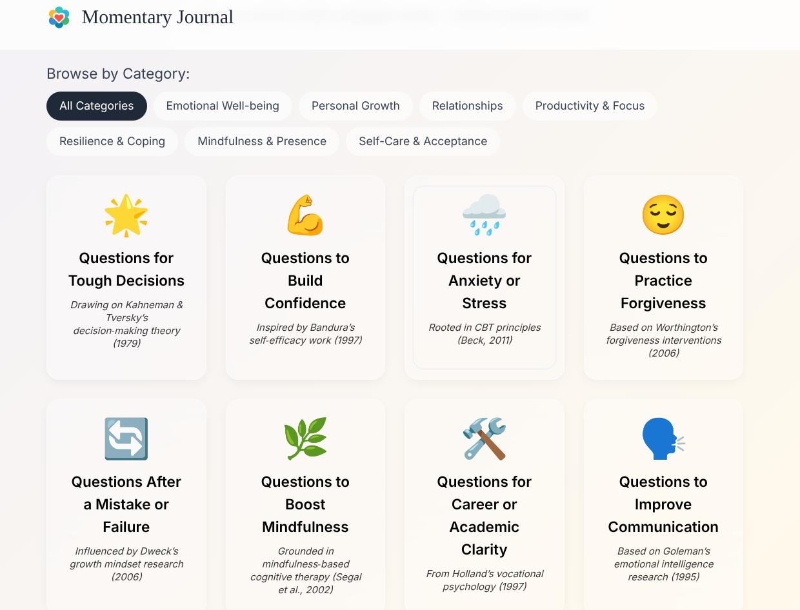

# Momentary Journal

**[Live Demo](https://whatareyoufeeling.vercel.app)**

A simple, private, and ephemeral journaling app designed for guided self-reflection. Your thoughts are yours alone—nothing is ever saved or stored.



---

## ✨ Key Features

*   **Privacy First**: Your answers remain completely private. The app is 100% client-side, and no data is ever sent to a server or stored in any database.
*   **Guided Prompts**: Explore dozens of thoughtfully designed categories, each with focused questions inspired by established psychological principles (CBT, Positive Psychology, etc.).
*   **Emotional Categorization**: Quickly find relevant prompts by browsing high-level classes like *Emotional Well-being*, *Personal Growth*, and *Relationships*.
*   **Beautiful & Minimalist UI**: A clean, calming interface with subtle animations to help you focus on your thoughts.
*   **Frictionless Experience**: No login, no signup. Just open the page and start reflecting.
*   **Instant & Ephemeral**: Designed for in-the-moment reflection. Once you complete a session, your answers are gone, encouraging you to focus on the process, not the record.

## 🛠️ Tech Stack

*   **Frontend**: HTML5, CSS3, JavaScript (ES6+)
*   **Framework**: [Alpine.js](https://alpinejs.dev/) for lightweight reactivity.
*   **Styling**: [Tailwind CSS](https://tailwindcss.com/) (via CDN) for utility-first styling.
*   **Animations**: Custom CSS animations and [Canvas-Confetti](https://github.com/catdad/canvas-confetti) for a little celebration.

## 🚀 Getting Started

This project is a static website with no build process, making it incredibly simple to run locally.

1.  **Clone the repository:**
    ```bash
    git clone https://github.com/deadsmash07/What-Are-you-feeling-.git
    ```

2.  **Navigate to the project directory:**
    ```bash
    cd self_care
    ```

3.  **Open `index.html` in your browser.**
    *   The easiest way is to use a live server. If you're using Visual Studio Code, you can install the [Live Server](https://marketplace.visualstudio.com/items?itemName=ritwickdey.LiveServer) extension, right-click on `index.html`, and select "Open with Live Server".

## 💡 Project Philosophy

The core idea behind Momentary Journal is to provide a safe, private space for reflection without the pressure of creating a permanent archive. It's about the *act* of thinking and writing, not the artifact. By being ephemeral, it encourages honest, in-the-moment introspection.

## ❤️ Author

This project was created with ❤️ by **deadsmash07**.

*   **GitHub**: [@deadsmash07](https://github.com/deadsmash07)

